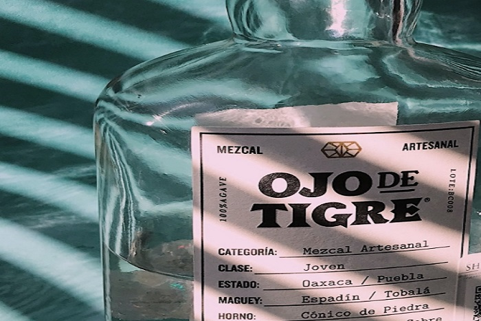

# Solucion de vinculo:  Galeria

## Una de las formas en la cual resolveria el problema de la visualización de la galeria, seria.
--
1. flexbox.
2. javaScript (para la funcionalidad de galeria).
3. CSS 
4. HTML

--
* Primer punto:
### Flexbox como parte de la solución, tiene muchas caracteristicas una de ellas es que: su desarrollo para first movile es facil de resolver, puesto que tiene caracteristicas que las "grid" de "Bootstrap" aun no tienen. 

### el diseño en Html, se puede componer de: "row"y "column" en la cual podremos alinear, justificar, centrar etc, los componentes de la galeria unidimensionalmente de modo que mejora las capacidades de alineación. 

--
### Teniendo en cuenta las caracteristicas de Flexbox y proyectando a futuro el proyecto, podemos determinar que es una solución viable, si se requiere compilar en la pestaña de "GALERIA" todas las imagenes (sesiones de fotografia, eventos, ediciones especiales etc). Esta seria de gran utilidad para ese tipo de casos.

# Explicación de como haría el código.

--
### Lo tendria dentro de un contener "row" que tiene las siguientes caracteristicas en su estilo:

* Es display:flex;
* Flex: wrap; para que las imagenes esten en secuencia y sea responsive.

### Dentro de mi "row", pondría 2 "columnas" en las cuales van insertadas las imagenes, con las siguiente caracteristicas.

* tamaño de imagenes de 100%
* formataer los espaciado
* funcion para visualizar en dispositivos pequeños.

### Las imagenes tendrían el siguiente estilo.

* En las imagenes pondria tener efecto de zoomm... (hover).
* La imagen al hacerle click, se podria posicionar en toda la pantalla con un botón que nos lleve a otro sitio creado o de contenido (formulario, facebook, youtube, twiteer).
* para esta galeria seria importante tener botones para visualizar todo el contenido, 4 imagenes, 8 imagenes, etc.

### Pondría 4 medidas de visualizacion para los diferentes dispositivos: @media

* @media screen and (min-width: 360px).
* @media screen and (min-width: 576px).
* @media screen and (min-width: 768px).
* @media screen and (max-width: 1100px).

### Para tener todas las medida de dispositivos de visualización.

## A continuación se muestra un ejemplo de el código en HTML y CSS.
--

´´´
<html lang="en">
<head>
	<meta charset="UTF-8">
	<meta name="viewport" content="width=device-width, initial-scale=1.0">
    <link rel="stylesheet" href="stilos.css">
	<title>galeria_ojo_de_tigere</title>
</head>
<body>
	
 
  

    
    
    
    
    
    
    
  

  

    
    
    
    
    
    
  
  

</body>
</html>

´´´

## código de css
--

´´´css

´´´

### Utilizacion de breakpoints

´´´

´´´

### Se puede utilizar una funcion en javaScript para hacer botones, estos pueden tener la fincion de visualizar la galeria en 3 formas.

- 1.  es para visualizar solo una de las  imagenes.
- 2. la siguiente se pueden ver solo 2 (dependiendo de la función.
- 3. visualizacion de 3 o "n" imagenes en nuestra función.

## En conclusión: 
### flexbox nos permite una gran escalabilidad para nuestros proyectos web, para darle soporte y mantenimiento a nuestro código.

### y tiene una gran ventaja en cuestion de diseños responsive, y se puede dar mejor mantenimiento al tamaño de los componentes para dispositivos moviles.

### Manteniendo las tendencias de desarrollo web.  

  

